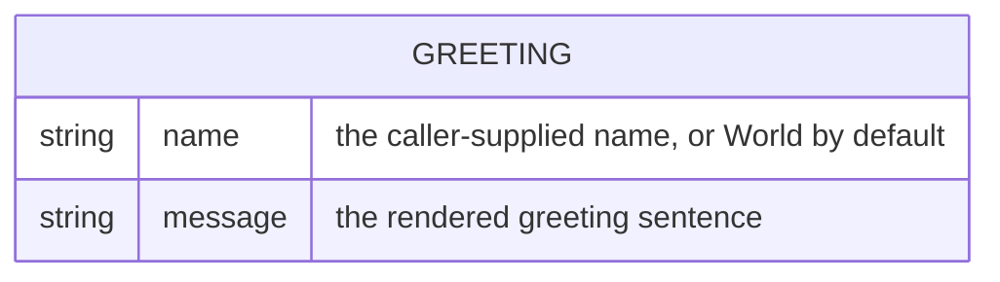

# Domain model

Greeter holds no persisted data — a `Greeting` exists only for the lifetime of
one request/response and is never stored.

`Greeting` is a transient value computed from the request's `name` query
parameter; it has no identity, no persistence, and no relations to any other
entity.